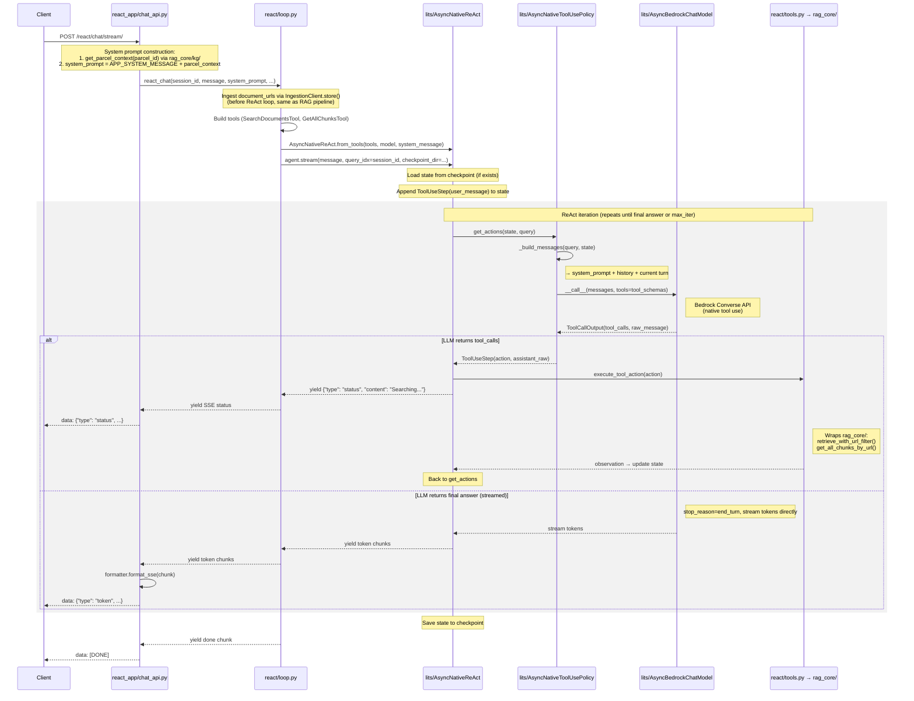

# Agentic URL Handling

## Problem

When a user says "summarize this PDF: https://xxx" or "what's in https://xxx", the current system:
1. Ignores URLs in the user message (only uses KG-resolved or request-supplied `document_urls`)
2. Uses top-K chunk retrieval, which doesn't work for "summarize the whole document"

## Design Principle

**Don't touch existing RAG workflow.** The current `chat()` / `async_chat()` pipeline stays as-is. The agent is a new, separate subpackage that can call into existing components as tools.

## Package Structure

```
lits/                ← lits_llm package (extended, not forked)
  lm/
    async_bedrock.py    ← NEW: async + native tool use
  components/policy/
    native_tool_use.py  ← NEW: structured tool call policy
  agents/chain/
    native_react.py     ← NEW: async/streaming ReAct

rag_core/            ← existing RAG pipeline (untouched)
  chat/
    service.py
    retriever.py        ← add get_all_chunks_by_url()
    config.py
  ingestion/
    main_client.py
  kg/
    client.py
    context.py
  utils/

react/               ← this project's ReAct integration
  __init__.py
  tools.py              BaseTool subclasses wrapping rag_core
  loop.py               Thin wrapper around AsyncNativeReAct

rag_app/             ← RAG endpoints (renamed from app/)
  chat_api.py

react_app/           ← ReAct endpoints (NEW)
  chat_api.py

main.py              ← FastAPI app, mounts both routers
```

`react/` imports from `rag_core/` and `lits/`. `rag_core/` never imports from `react/` or `lits/`.

## Architecture

### Current Pipeline (unchanged)

```
rag_app/chat_api.py → service.async_chat() → fixed pipeline → SSE stream
```

### New Agent Mode (parallel path)

```
react_app/chat_api.py → react/loop.py → lits/AsyncNativeReAct → ReAct loop → SSE stream
```

Two independent routers mounted on the same FastAPI instance via `main.py`.

## ReAct Loop

Implemented via `lits/AsyncNativeReAct`, which uses Bedrock's native tool use API (structured JSON tool calls, not text-parsing). See "LiTS Integration" section for full architecture.

The loop uses `converse_stream()` for every LLM call. `contentBlockStart` determines whether the response is a tool call or final answer — no need to wait for `stop_reason`.

## Tools (`agent/tools.py`)

Tool interface follows lits_llm's `BaseTool` pattern: `name`, `description`, `args_schema` (Pydantic), `_run()`.

Note: lits_llm has its own general LLM interface that includes BedrockConverse — not litellm.

| Tool | Description | Wraps | Source |
|------|-------------|-------|--------|
| `search_documents` | Semantic search over session documents (top-K, needs embedding) | `retrieve_with_url_filter()` | `rag_core/chat/retriever.py::retrieve_with_url_filter` |
| `get_all_chunks` | Get ALL chunks for a URL via payload filter (no embedding, for summarization) | Qdrant `scroll` with URL filter | To be added in `rag_core/chat/retriever.py` |

Ingestion happens before the ReAct loop (same as existing RAG pipeline): `react_app/chat_api.py` resolves `document_urls` from KG, calls `IngestionClient.store()` for each, then enters the agent. LLM only queries already-ingested documents.

Tools are thin wrappers around existing components. No duplication of ingestion/retrieval logic.

Each tool is a `BaseTool` subclass (`lits/tools/base.py`). Wrapping pattern:

```python
# react/tools.py
from lits.tools.base import BaseTool
from pydantic import BaseModel, Field

class SearchDocumentsInput(BaseModel):
    query: str = Field(..., description="Semantic search query")
    top_k: int = Field(5, description="Number of chunks to return")

class SearchDocumentsTool(BaseTool):
    name = "search_documents"
    description = "Search session documents by semantic similarity. Returns top-K relevant chunks."
    args_schema = SearchDocumentsInput

    def _run(self, query: str, top_k: int = 5) -> str:
        results = retrieve_with_url_filter(self.index, query, self.urls, top_k)
        return format_results(results)
```

### Tool Schema Example (for Bedrock Converse API)

```python
tool_schemas = [
    {
        "name": "search_documents",
        "description": "Search session documents by semantic similarity. Returns top-K relevant chunks.",
        "input_schema": {
            "type": "object",
            "properties": {
                "query": {"type": "string", "description": "Semantic search query"},
                "top_k": {"type": "integer", "description": "Number of chunks to return", "default": 5}
            },
            "required": ["query"]
        }
    },
    {
        "name": "get_all_chunks",
        "description": "Get all chunks of a specific document by URL. Use for summarization.",
        "input_schema": {
            "type": "object",
            "properties": {
                "url": {"type": "string", "description": "Document URL to retrieve all chunks from"}
            },
            "required": ["url"]
        }
    }
]
```

## Integration with FastAPI

RAG 和 ReAct 是两组独立的 router，通过 `main.py` 挂到同一个 FastAPI 实例：

```python
# main.py
from fastapi import FastAPI
from rag_app.chat_api import router as rag_router
from react_app.chat_api import router as react_router

app = FastAPI()
app.include_router(rag_router, prefix="/rag")
app.include_router(react_router, prefix="/react")
```

```python
# react_app/chat_api.py
from fastapi import APIRouter
from react.loop import react_chat

router = APIRouter()

@router.post("/chat/stream/")
async def react_stream_endpoint(request: ChatRequest):
    parcel_data = _resolve_parcel_data(request.session_id, logger)
    
    async def generate():
        async for chunk in react_chat(
            session_id=request.session_id,
            message=request.message,
            system_message=parcel_data["system_message"],
            parcel_context=parcel_data["parcel_context"],
            document_urls=parcel_data["document_urls"],
        ):
            yield formatter.format_sse(chunk)
    
    return StreamingResponse(generate(), media_type="text/event-stream")
```

Endpoints:
- `POST /rag/chat/stream/` → existing RAG pipeline (unchanged)
- `POST /react/chat/stream/` → AsyncNativeReAct agent
- `DELETE /react/sessions/{session_id}` → archive state, clean session_index

### SSE Event Types

ReAct streaming uses the same SSE format as the RAG pipeline, with one addition (`status`):

| type | When | Content | Frontend handling |
|------|------|---------|-------------------|
| `status` | Agent is executing a tool call | Human-readable status, e.g. "Searching documents..." | Show as spinner/indicator, auto-dismiss when `token` starts |
| `token` | Streaming final answer | Token text | Append to answer area |
| `error` | Something failed | Error message | Show error |
| `done` | Generation complete | Full answer + citations + timing | Finalize UI |

```
data: {"type": "status", "content": "Searching documents..."}
data: {"type": "status", "content": "Reading the full document..."}
data: {"type": "token", "content": "Based on "}
data: {"type": "token", "content": "the assessment report..."}
data: {"type": "done", "answer": "...", "citations": [...], "timing": {...}}
```

Tool name → status message mapping:

```python
STATUS_MAP = {
    "search_documents": "Searching documents...",
    "get_all_chunks": "Reading the full document...",
}
```

## What We Reuse from lits_llm

1. **Tool interface**: `BaseTool` with `name`, `description`, `args_schema`, `_run()`
2. **Components**: `Policy`, `Transition`, `ToolUseState`, `ToolUseStep` — extended with native tool use support
3. **Agent**: `ChainAgent` checkpoint mechanism (state load/save via `query_idx` + `checkpoint_dir`)
4. **Loop structure**: policy → transition → state append → repeat

What we ADD to lits (all new files, zero changes to existing):
- `AsyncBedrockChatModel` — async LM with native tool use + streaming
- `AsyncNativeToolUsePolicy` — structured tool calls instead of text parsing
- `AsyncNativeReAct` — async/streaming ReAct agent with `from_tools()` factory

## LiTS Integration

This project serves as a testbed for extending lits into a public-friendly agent framework. Instead of writing a standalone `agent/loop.py`, we implement the ReAct loop using lits components — and extend lits where needed.

### LiTS Architecture (current)

```
lits/
├── lm/                          ← LLM interface layer
│   ├── base.py                     LanguageModel, Output, InferenceLogger
│   ├── bedrock_chat.py             BedrockChatModel (Converse API, text output)
│   ├── openai_chat.py              OpenAIChatModel
│   └── __init__.py                 get_lm() factory
│
├── structures/                  ← Data structures (decoupled from components)
│   ├── base.py                     Step (abstract), StateT/ActionT type vars
│   ├── tool_use.py                 ToolUseAction, ToolUseStep, ToolUseState
│   └── trace.py                    Serialization, log_state()
│
├── tools/                       ← Tool interface
│   ├── base.py                     BaseTool (name, description, args_schema, _run)
│   └── utils.py                    execute_tool_action() — text-based dispatch
│
├── components/                  ← Granular components (Policy, Transition, Reward)
│   ├── base.py                     Policy[StateT, StepT], Transition[StateT, StepT]
│   ├── policy/tool_use.py          ToolUsePolicy — text-based action generation
│   └── transition/tool_use.py      ToolUseTransition — tool execution
│
├── agents/chain/                ← Agent orchestration
│   ├── base.py                     ChainAgent (checkpoint, resume)
│   └── react.py                    ReActChat (sync loop: policy → transition → repeat)
│
├── prompts/                     ← Prompt templates + registry
└── eval/                        ← Benchmarking (not relevant here)
```

### Current data flow (text-based tool use)

```
ReActChat.run(query)
  │
  ├─ ToolUsePolicy._get_actions(state, query)
  │    ├─ state.to_messages(query)          → build message list
  │    ├─ BedrockChatModel.__call__(msgs)   → Converse API → text response
  │    └─ ToolUseStep.from_assistant_message(text)  → XML parse <action>...</action>
  │
  ├─ ToolUseTransition.step(state, step)
  │    ├─ execute_tool_action(action_str, tools)  → text-based tool dispatch
  │    └─ step.observation = result
  │
  └─ state.append(step) → repeat until step.answer is not None
```

Key observation: the entire flow is **text-based**. LLM outputs text → parse XML tags → extract action → execute → append observation as text. This works but is fragile (parsing failures) and doesn't leverage Bedrock's native tool use API.

### What needs to change in lits

#### 1. LM layer: async + native tool use

**Analysis: separate async class vs adding async to existing class?**

Separate class (`AsyncBedrockChatModel`) is cleaner:
- `BedrockChatModel.__call__` is sync, returns `Output(text)`. Adding async to it means either dual code paths in one class or breaking the sync interface.
- Python's async/sync split is fundamental — you can't `await` in a sync `__call__`. A mixin or protocol approach gets messy.
- Separate class keeps the sync class untouched (zero risk to existing research pipelines).
- The async class can have a different return type (`ToolCallOutput` with structured tool calls) without polluting the sync `Output`.

```python
# lits/lm/async_bedrock.py (NEW)
class AsyncBedrockChatModel:
    """Async Bedrock client with native tool use support.
    
    Key differences from BedrockChatModel:
    - async __call__ using aioboto3
    - tools parameter for native tool use (Converse API toolConfig)
    - Returns ToolCallOutput when tools are provided
    - astream() for token streaming
    """
    
    async def __call__(self, prompt, tools=None, **kwargs) -> Output | ToolCallOutput:
        """
        When tools=None: same as sync version, returns Output(text)
        When tools provided: uses Converse API toolConfig, returns ToolCallOutput
        """
        ...
    
    async def astream(self, prompt, **kwargs) -> AsyncGenerator[str, None]:
        """Stream tokens for final answer generation."""
        ...
```

```python
# lits/lm/base.py (extend)
class ToolCallOutput(Output):
    """Output with structured tool calls from native tool use API."""
    tool_calls: list[ToolCall]  # [{name, input_args, id}]
    stop_reason: str            # "tool_use" or "end_turn"
    raw_message: dict           # LLM's raw assistant message (provider-specific format)
```

Both classes share the same `InferenceLogger` and config patterns. `get_lm()` factory gets a new prefix: `get_lm("async-bedrock/us.anthropic.claude-opus-4-6-v1")`.

Each LM class provides a `format_tool_result()` method for constructing provider-specific tool result messages. This keeps the format knowledge in the LM layer, so Policy code is provider-agnostic:

```python
# lits/lm/async_bedrock.py
class AsyncBedrockChatModel:
    def format_tool_result(self, tool_use_id: str, observation: str) -> dict:
        """Bedrock Converse API format."""
        return {
            "role": "user",
            "content": [{"toolResult": {
                "toolUseId": tool_use_id,
                "content": [{"text": observation}]
            }}]
        }

# lits/lm/openai_chat.py (future)
class AsyncOpenAIChatModel:
    def format_tool_result(self, tool_use_id: str, observation: str) -> dict:
        """OpenAI format."""
        return {"role": "tool", "tool_call_id": tool_use_id, "content": observation}
```

#### 2. Components: AsyncNativeToolUsePolicy

New policy subclass that uses native tool use instead of text parsing:

```python
# lits/components/policy/native_tool_use.py (NEW)
class AsyncNativeToolUsePolicy(Policy[ToolUseState, ToolUseStep]):
    """Policy using LLM's native tool use API (structured tool calls).
    
    Overrides:
    - _build_messages(): generates Converse API format (toolUse/toolResult blocks)
      instead of text-based <action>/<observation> XML tags
    - _get_actions(): passes tool_schemas to LLM, handles ToolCallOutput
    """
    
    def _build_messages(self, query, state):
        """Convert ToolUseState to Converse API message format.
        
        Uses assistant_raw from each step (LLM's original response) directly.
        Uses self.base_model.format_tool_result() for tool result messages,
        keeping this method provider-agnostic.
        """
        messages = [{"role": "user", "content": [{"text": query}]}]
        for step in state:
            if step.assistant_raw:
                # 1. Assistant message: use LLM's raw response directly
                messages.append(step.assistant_raw)
                # 2. Tool result: delegate format to LM layer
                if step.observation is not None:
                    tool_use_id = step.assistant_raw["content"][0]["toolUse"]["toolUseId"]
                    messages.append(
                        self.base_model.format_tool_result(tool_use_id, step.observation)
                    )
            elif step.answer:
                messages.append({"role": "assistant", "content": [{"text": step.answer}]})
        return messages
    
    def _get_actions(self, state, query, n_actions, temperature, **kwargs):
        messages = self._build_messages(query, state)
        
        # tools passes through Policy._call_model **kwargs → base_model(**kwargs)
        response = self._call_model(messages, tools=self.tool_schemas, temperature=temperature)
        
        if isinstance(response, ToolCallOutput) and response.tool_calls:
            return [ToolUseStep(
                action=tc.to_action(),
                assistant_raw=response.raw_message,  # store LLM's raw assistant message
            ) for tc in response.tool_calls]
        else:
            return [ToolUseStep(answer=response.text)]
```

Existing `ToolUsePolicy` (text-based) stays untouched. Users choose which policy to use.

#### 3. Agents: AsyncNativeReAct

```python
# lits/agents/chain/native_react.py (NEW)
class AsyncNativeReAct(ChainAgent[ToolUseState]):
    """ReAct agent using native tool use API.
    
    Differences from ReActChat:
    - Uses AsyncNativeToolUsePolicy (structured tool calls, not text parsing)
    - Supports async execution via run_async()
    - Supports streaming final answer
    - Factory method from_tools() for simple setup
    """
    
    @classmethod
    def from_tools(cls, tools: list[BaseTool], model_name: str, **kwargs):
        """Simple factory: just provide tools and model name."""
        model = get_lm(f"async-bedrock/{model_name}")
        policy = AsyncNativeToolUsePolicy(base_model=model, tools=tools)
        transition = ToolUseTransition(tools=tools)
        return cls(policy=policy, transition=transition, **kwargs)
    
    def run(self, query, **kwargs) -> ToolUseState:
        """Sync execution (same as ReActChat)."""
        ...
    
    async def run_async(self, query, **kwargs) -> ToolUseState:
        """Async execution."""
        ...
    
    async def stream(self, query, **kwargs) -> AsyncGenerator[dict, None]:
        """Async streaming: yields tool-use steps, then streams final answer tokens."""
        ...
```

#### 4. Summary of changes to lits

| File | Change | Risk to existing code |
|------|--------|-----------------------|
| `lm/async_bedrock.py` | NEW file | None — new class |
| `lm/base.py` | Add `ToolCallOutput` | None — extends `Output` |
| `lm/__init__.py` | Add `async-bedrock/` prefix to `get_lm()` | None — new prefix |
| `components/policy/native_tool_use.py` | NEW file | None — new class |
| `agents/chain/native_react.py` | NEW file | None — new class |
| `structures/tool_use.py` | Add `assistant_raw: Optional[dict] = None` and `user_message: Optional[str] = None` to `ToolUseStep` | None — optional fields with defaults |

Zero changes to existing class behavior. All new code. Existing research pipelines (text-based ReActChat, MCTS, etc.) are completely unaffected.

### How this project uses lits

```python
# react/loop.py — this project's ReAct integration
from lits.agents.chain.native_react import AsyncNativeReAct
from react.tools import SearchDocumentsTool, GetAllChunksTool

async def react_chat(session_id, message, system_message, parcel_context, document_urls, ...):
    """Multi-turn ReAct chat with state persistence via lits checkpoint."""
    
    # 1. Ingest documents BEFORE entering ReAct loop (same as RAG pipeline)
    ingestion_client = get_ingestion_client()
    if document_urls:
        for url in document_urls:
            ingestion_client.store(url, session_id=session_id)
    
    # 2. Build tools (session-scoped, query only — no ingestion tool)
    tools = [
        SearchDocumentsTool(ingestion_client, session_id),
        GetAllChunksTool(ingestion_client, session_id),
    ]
    
    # 3. Create agent (system_message + parcel_context → system prompt)
    agent = AsyncNativeReAct.from_tools(
        tools=tools,
        model_name="us.anthropic.claude-opus-4-6-v1",
        system_message=system_message + "\n\n" + parcel_context,
        max_iter=10,
    )
    
    # 4. Run ReAct loop with streaming
    #    lits internally: load state from checkpoint → append user_message step
    #    → ReAct loop → save state to checkpoint
    async for chunk in agent.stream(
        message,
        query_idx=session_id,
        checkpoint_dir="data/chat_state/",
    ):
        yield chunk
```

### Call flow diagram



### Package structure

See "Package Structure" section at the top of this document.

## Conversation History

Agent mode uses raw conversation history instead of Mem0 fact extraction.
Opus 4.6 has 1M context — a parcel session of ~20 turns is negligible.

### Why not Mem0 for agent mode

- Mem0 adds ~10s per request (fact extraction + Qdrant read/write)
- Fact extraction is lossy — raw history preserves full context
- Agent's ReAct loop already maintains a `messages` list — just persist it

### History lives inside ToolUseState

对话历史不是外部的独立存储，而是 `ToolUseState` 的一部分。`ToolUseState` 是 `list[ToolUseStep]`，每轮对话的所有消息（user message, tool calls, final answer）都是 step。多轮对话就是 step 不断 append，state 不重置。

`ToolUseStep` 新增一个 optional 字段 `user_message: Optional[str] = None`，表示纯 user turn：

```
ToolUseState = [
  # ── 第1轮 ──
  ToolUseStep(user_message="Is this a priority site?"),
  ToolUseStep(action=search_docs, observation="...", assistant_raw={...}),
  ToolUseStep(answer="Yes, based on PSR..."),
  # ── 第2轮 ──
  ToolUseStep(user_message="What audits were done?"),
  ToolUseStep(answer="There is one environmental audit..."),
]
```

好处：
- `_build_messages` 遍历 state，每个 step 调 `step.to_messages()`，自然生成完整的对话 + tool use 消息序列
- `TrajectoryState.save()`/`load()` 自动序列化整个对话历史，checkpoint 恢复就恢复了完整对话
- 不需要外部的 `ChatHistory` class 或单独的 JSON 文件
- 符合 RL 的 state 定义：state 包含做决策所需的所有信息

### AsyncNativeReAct 多轮调用

每次HTTP请求调用 `agent.stream(message, query_idx=session_id, checkpoint_dir=...)`，lits 内部自动 load/save state：

```python
# 第1轮请求：lits 发现没有 checkpoint，从空 state 开始
# state: [user_step("Is this a priority site?"), tool_step, answer_step]
# lits 自动 save 到 data/chat_state/{session_id}.json

# 第2轮请求：lits load checkpoint，在已有 state 上 append
# state: [...第1轮..., user_step("What audits were done?"), answer_step]
# lits 自动 save 更新后的 state
```

调用方（`react/loop.py`）不需要手动管理 state 文件。

### Cleanup

DELETE endpoint 清理运行时资源（session_index），但保留 state JSON 文件和 parcel_cache：
- state JSON：rename 为 `{session_id}__{timestamp}.json`（如 `433375739__test1__20260413_160018.json`），这样同一个 session_id 可多次 delete，每次归档带时间戳，前端重新开始时从空 state 开始
- parcel_cache：parcel 级别，多个 session 共享，默认不清理（与 rag_app 行为一致）

### Existing pipeline unaffected

`chat()` / `async_chat()` with Mem0 stays as-is. Conversation history via state is agent-mode only.

## Scope

Covers:
- lits extensions: `AsyncBedrockChatModel`, `AsyncNativeToolUsePolicy`, `AsyncNativeReAct`
- `react/` subpackage (tools + loop wrapping AsyncNativeReAct)
- `react_app/` endpoints + `main.py` router mount
- Conversation history via ToolUseState persistence (replaces Mem0 for agent mode)
- Streaming support for final answer
- `rag_app/` rename from `app/`

Does NOT cover:
- Multi-step retrieval / query rewriting
- Self-critique / reflection loops
- Modifying existing `rag_core/chat/service.py`
- Modifying existing lits classes (all changes are additive)


## Q&A

**Q: 同一个session_id同时用RAG和ReAct路径会不会冲突？**

不会。两条路径共享的只是底层数据（Qdrant里的chunks、session_index），这些是只读或幂等的。记忆机制完全独立——RAG用Mem0（fact extraction存Qdrant collection），ReAct用JSON对话历史，互不干扰。实际使用中前端应固定一个session用一种模式。

**Q: 为什么用raw conversation history替代Mem0？**

核心问题：Mem0做的是fact extraction（把对话压缩成独立的事实），丢失了对话的顺序和上下文。当用户说"你刚刚说的XXX是什么意思？"这类指代前文的问题时，Mem0提取的facts里没有"刚刚说了什么"这个信息，LLM无法回答。Raw history保留完整对话流，自然支持这类回指。

其他原因：
- Mem0每次请求增加~10s延迟（fact extraction + Qdrant读写）
- Opus 4.6有1M context，一个parcel session十几轮对话的token量可忽略
- Agent的ReAct loop天然维护messages列表，持久化到JSON即可

**Q: 为什么拆成 `rag_app/` 和 `react_app/` 两个目录？**

Decouple。两组endpoints代码完全分开，通过FastAPI的`APIRouter` + `include_router()`挂到同一个FastAPI实例。一个`uvicorn`进程，一个端口，两组独立路由（`/rag/*` 和 `/react/*`）。

**Q: 为什么新建 `AsyncBedrockChatModel` 而不是在现有 `BedrockChatModel` 上加 async？**

Python的sync/async是根本性的分裂——`__call__`不能同时是sync和async。在一个类里做dual code path会导致：
- 每个方法都要写两遍（`_converse_api` + `_converse_api_async`）
- 返回类型不一致（sync返回`Output(text)`，async+tools返回`ToolCallOutput`）
- 现有sync用户被迫处理新的返回类型

分开后：sync类零改动，async类自由设计返回类型和streaming接口。两者共享`InferenceLogger`和config模式。

**Q: `AsyncNativeToolUsePolicy._build_messages` 需要手工构建Converse API格式的messages吗？**

不需要手工重建assistant message。LLM返回的raw assistant message（包含`toolUse` block）直接存在`ToolUseStep.assistant_raw`里，`_build_messages`原样使用。只有tool result message需要构建，但它只是把`observation`文本 + 从`assistant_raw`提取的`toolUseId`包装成Converse格式，很简单。

**Q: `ToolUseStep`和`ToolUseState`需要重新定义吗？**

不需要。`ToolUseState`是`List[ToolUseStep]`，不动。`ToolUseStep`加两个optional字段：`assistant_raw: Optional[dict] = None`（LLM原始assistant message）和`user_message: Optional[str] = None`（纯user turn）。现有text-based流程不用这些字段（默认None），完全向后兼容。

**Q: 对话历史应该放在ToolUseState里还是外部单独管理？**

放在ToolUseState里。State在RL里就是用来represent做决策所需的所有信息的。对话历史是做决策的必要context，属于state。

具体做法：多轮对话不重置state，每轮的user message、tool calls、final answer都作为ToolUseStep append到同一个state。`TrajectoryState.save()`/`load()`自动序列化整个对话历史，checkpoint恢复就恢复了完整对话。不需要外部的ChatHistory class或单独的JSON文件。

**Q: state的load/save应该在lits内部还是外部（react/loop.py）管理？**

lits内部。lits已有`ChainAgent`的checkpoint机制（`checkpoint_dir` + `query_idx`）。`query_idx`概念上和`session_id`一样——都是定位一个state文件。`AsyncNativeReAct`复用这个机制：调用方传`query_idx=session_id`和`checkpoint_dir`，lits内部自动load → run → save。`react/loop.py`不需要手动管理state文件。

**Q: `Policy._call_model`没有`tools`参数，怎么传tool schemas给LLM？**

`Policy._call_model`签名是`def _call_model(self, prompt, **kwargs)`，`**kwargs`透传给`self.base_model()`。所以`_call_model(messages, tools=self.tool_schemas)`会变成`self.base_model(messages, role=role, tools=self.tool_schemas)`。不需要override `_call_model`，只需要`AsyncBedrockChatModel.__call__`接受`tools`参数。

**Q: `tool_result_raw`需要单独存吗？**

不需要。tool result可以从`observation`（纯文本）+ `assistant_raw`里的`toolUseId`实时构建。真正需要存的只有`assistant_raw`，因为那是LLM返回的原始格式，不想手工重建。一个新字段就够了。

**Q: tool result message的构建应该放在ToolUseStep里吗？不同LLM的格式一样吗？**

不应该放在ToolUseStep里。`ToolUseStep`是structures层的数据结构，应该是provider-agnostic的，只存数据（action, observation, answer, assistant_raw），不知道怎么格式化成某个API的message格式。

不同LLM的tool result格式不一样：Bedrock用`{"toolResult": {"toolUseId": ...}}`，OpenAI用`{"role": "tool", "tool_call_id": ...}`，Anthropic直接API用`{"type": "tool_result", "tool_use_id": ...}`。所以构建逻辑是provider-specific的，放在LM层——每个LM class提供`format_tool_result(tool_use_id, observation)`方法。Policy调用`self.base_model.format_tool_result()`，换provider只需要换LM class，Policy代码不动。


**Q: 为什么不把 `search_documents` 和 `get_all_chunks` 合成一个 `retrieve` tool？**

两个操作本质不同：`search_documents` 是语义搜索（需要embedding计算），`get_all_chunks` 是payload filter（Qdrant `scroll`，不需要embedding，纯metadata查询）。合在一起需要LLM理解"传query走搜索，传url走全量"的隐式逻辑。两个独立tool各自职责单一，description清晰，LLM更容易正确调用。

**Q: lits自带的 `PDFQueryTool` 需要用吗？**

不需要。`PDFQueryTool` 是 `ingest_pdf` + `search_documents` 合在一起（给URL+query → 下载+索引+搜索）。拆开更灵活——agent可以先ingest一次，然后多次search不同query，而`PDFQueryTool`每次都要传URL。


**Q: `ingest_pdf` 需要作为 LLM tool 吗？**

不需要。KG-resolved 的 `document_urls` 在进入 ReAct loop 之前就已经确定了，ingestion 在 `react_app/chat_api.py` 里完成（和现有 RAG pipeline 一样）。LLM 只负责查询已有文档。system message 里明确说明只处理内部文档，用户如果给了外部 URL，LLM 会告知无法处理。

**Q: `get_all_chunks_by_url()` 写在哪里？**

写在 `rag_core/chat/retriever.py` 里，和 `retrieve_with_url_filter()` 并列。一个是语义搜索（top-K，需要embedding），一个是全量获取（Qdrant `scroll`，payload filter，不需要embedding）。都是 retriever 层的职责。`GetAllChunksTool` 只是薄 wrapper 调用它。


**Q: Agent 做 tool call 时要不要 stream 给前端？直接暴露技术细节不太友好？**

不暴露技术细节。Agent 执行 tool call 时发 `{"type": "status"}` SSE event，内容是自然语言（如 "Searching documents..."、"Reading the full document..."），通过 `STATUS_MAP` 从 tool name 映射。前端显示为状态指示器（spinner + 文字），token 开始流之后自动消失。和现有 RAG pipeline 的 SSE 格式完全兼容，只是多了一个 `status` type。


**Q: Final answer 的 streaming 怎么实现？需要两次 LLM 调用吗？**

不需要。ReAct loop 里每次 LLM 调用都用 streaming 模式（`astream`）。当 `stop_reason=end_turn`（不是 tool call）时，tokens 直接流式 yield 给前端——这就是 final answer，不需要第二次调用。之前 diagram 的错误是画成"先拿到完整 answer，再用 astream 重新生成一遍做 streaming"，等于让 LLM 回答两次，已修正。

注意：tool call 的 response 也是一次完整返回（Bedrock Converse API 不会分 chunk 返回 tool call），只有 final answer 需要 streaming。所以 loop 里的逻辑是：每次调用都 stream → 如果收到 tool_use block 就收集完整 response 后执行 tool → 如果收到 text 就逐 token yield。

**Q: `converse_stream()` 怎么区分 tool call 和 final answer？`stop_reason` 不是最后才到吗？**

不需要等 `stop_reason`。`converse_stream()` 的第一个 event `contentBlockStart` 就能区分：

- `contentBlockStart: {"toolUse": {"name": "search_documents"}}` → tool call，收集完整 tool call 后执行
- `contentBlockStart: {}` → text block，立刻开始逐 token yield 给前端

后续的 `contentBlockDelta` 逐个到达（text tokens 或 tool input JSON fragments），`messageStop: {"stopReason": "end_turn"}` 在最后才到，但不影响 streaming 决策。第一个 `contentBlockStart` 就够了。
