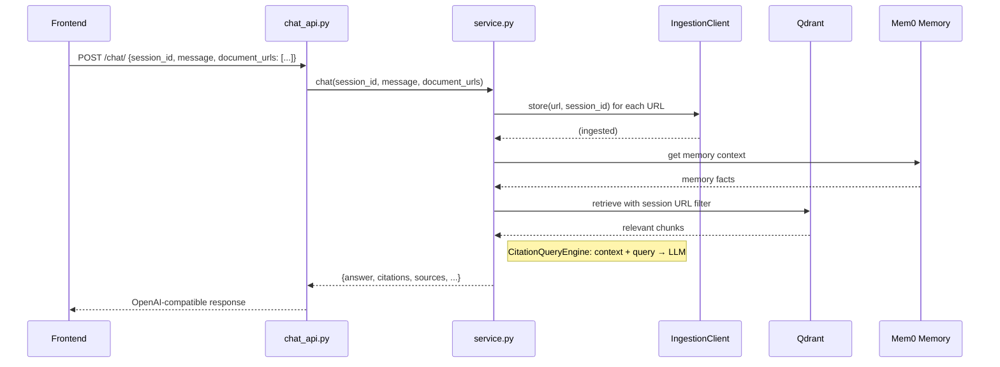
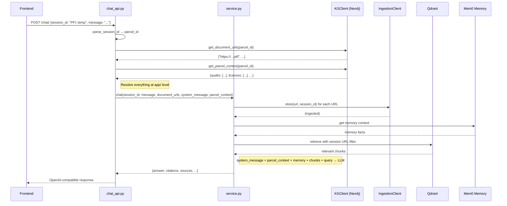

# Design: Parcel KG Integration

## Overview

Replace the frontend-supplied `document_urls` flow with a backend-driven flow where the parcel ID (extracted from the session ID `parcel_id::temp_id`) drives everything:

1. **Document URLs** — resolved from Neo4j KG via `(Parcel)-[:hasAssessmentReport]->(r:AssessmentReport)` → `r.hasLink`
2. **Parcel context** — assembled from all 7 KG connection types and injected as second-layer system message
3. **Session cleanup** — explicit `DELETE /chat/sessions/{session_id}` endpoint to clear memory + session index

The existing ingestion pipeline (`IngestionClient.store()`) and retrieval pipeline (`get_url_filtered_retriever()`) remain unchanged. Only the API entry point changes: instead of accepting `document_urls` from the request, the service resolves them from the KG.

## Architecture

### Current Architecture



Frontend supplies `document_urls` in the request. No knowledge graph involved.

### New Architecture (with KG Integration)



Frontend sends only `session_id` + `message`. The app/ layer (chat_api.py) resolves document URLs and parcel context from the KG, then passes them to the generic service layer. `service.py` stays application-agnostic.


## Main Workflow

### Session Lifecycle

1. **First message** for a `parcel_id::temp_id` session:
   - Parse session ID → extract `parcel_id`
   - Query KG for document URLs → ingest via existing pipeline
   - Query KG for parcel context → build system message
   - Cache both in memory (keyed by `parcel_id`) to avoid re-querying KG on subsequent messages

2. **Subsequent messages** for same session:
   - Skip KG queries (URLs + context already cached)
   - Retrieval + generation as before

3. **Session cleanup** (`DELETE /chat/sessions/{session_id}`):
   - Remove session from `session_index`
   - Delete Mem0 memory collection for session
   - Clear any cached KG data for the session

### Session ID Parsing

```python
def parse_session_id(session_id: str) -> tuple[str, str]:
    """Parse 'parcel_id::temp_id' → (parcel_id, temp_id).
    
    Raises ValueError if format is invalid (no '::' separator).
    """
    if "::" not in session_id:
        raise ValueError(f"Invalid session ID format: {session_id}. Expected 'parcel_id::temp_id'")
    parcel_id, temp_id = session_id.split("::", 1)
    return parcel_id.strip(), temp_id.strip()
```

## Components and Interfaces

### 1. `KGClient` — Neo4j Knowledge Graph Client

New module: `rag_core/kg/client.py`

Wraps the Neo4j Python driver. Connection via bolt protocol (SSH tunnel for local dev, direct on EC2).

```python
class KGClient:
    """Neo4j knowledge graph client for parcel data retrieval.
    
    Connection config from config.yaml under 'neo4j' key.
    Uses neo4j Python driver (bolt protocol).
    """
    
    def __init__(self, uri: str, user: str, password: str):
        """Initialize Neo4j driver."""
    
    def get_document_urls(self, parcel_id: str) -> list[str]:
        """Get all assessment report PDF URLs for a parcel.
        
        Cypher:
            MATCH (p:Parcel)-[:hasOnsiteAssessment|hasOffsiteAssessment]->(a:Resource)
                  -[:hasAssessmentReport]->(r:AssessmentReport)
            WHERE parcel_id IN p.hasPFI
            RETURN r.hasLink[0] AS pdf_url
        
        Returns:
            List of PDF URL strings. Empty list if parcel not found.
        """
    
    def get_parcel_context(self, parcel_id: str) -> dict:
        """Get all 7 connection types for a parcel as structured context.
        
        Returns dict with keys:
            audits, licences, prsa, psr, vlr, overlays, business_listings
        Each value is a list of dicts with assessment-specific fields.
        """
    
    def close(self):
        """Close the Neo4j driver connection."""
```

### 2. `format_parcel_context()` — System Message Builder

New function in `rag_core/kg/context.py`

```python
def format_parcel_context(parcel_id: str, kg_context: dict) -> str:
    """Format KG context dict into a natural-language system message block.
    
    Args:
        parcel_id: The parcel PFI.
        kg_context: Output of KGClient.get_parcel_context().
    
    Returns:
        String block to append to the system message, e.g.:
        
        ## Parcel Context (PFI: 433375739)
        ### Environmental Audits
        - Audit on 2019-03-15: [link]
        ### EPA Licences
        - Licence type: Research, Development and Demonstration ...
        ...
    """
```

### 3. Modified `chat()` / `async_chat()` in `service.py`

Changes to existing functions — add `system_message` and `parcel_context` parameters:

```python
# Before (current):
def chat(session_id, message, document_urls=None, ...):
    if document_urls:
        _ingest_documents(document_urls, session_id, config)

# After (new):
def chat(session_id, message, document_urls=None,
         system_message=None, parcel_context=None, ...):
    # document_urls, system_message, parcel_context all resolved by app/ layer
    if document_urls:
        _ingest_documents(document_urls, session_id, config)
    
    # Combine context layers into query:
    # system_message (Layer 1: app identity) + parcel_context (Layer 2: KG data)
    # + memory_context (Layer 3: Mem0 facts) + retrieved_chunks + user query
```

`service.py` stays application-agnostic — it doesn't know about parcels, KG, or Neo4j. It just receives strings.

### 4. Modified `chat_api.py` — KG Resolution at App Level

```python
# In app/chat_api.py

APP_SYSTEM_MESSAGE = """You are an environmental assessment assistant for Victorian land parcels.
You answer questions grounded in assessment reports and knowledge graph data.
Always cite sources using the provided markdown link format."""

@app.post("/chat/")
async def chat_endpoint(request: ChatRequest):
    parcel_id, temp_id = parse_session_id(request.session_id)
    
    # Resolve from KG (app-level concern)
    kg_client = get_kg_client()
    document_urls = kg_client.get_document_urls(parcel_id)
    kg_context = kg_client.get_parcel_context(parcel_id)
    parcel_context = format_parcel_context(parcel_id, kg_context)
    
    result = chat(
        session_id=request.session_id,
        message=request.message,
        document_urls=document_urls,
        system_message=APP_SYSTEM_MESSAGE,
        parcel_context=parcel_context,
    )
    return format_chat_response_openai(result)
```

### 5. New API Endpoint: Session Cleanup

```python
# In app/chat_api.py

@app.delete("/chat/sessions/{session_id}")
async def delete_session(session_id: str):
    """Clean up a parcel session: remove session index, memory, cached KG data."""
```

### 6. Modified `ChatRequest` Schema

```python
class ChatRequest(BaseModel):
    session_id: str  # Now expects "parcel_id::temp_id" format
    message: str
    # document_urls removed from required flow (kept optional for backward compat)
    document_urls: Optional[List[str]] = None
    top_k: int = 5
    use_memory: bool = True
    citation_style: str = "markdown_link"
```

## Data Models

### Session ID Format

```
parcel_id::temp_id
│           │
│           └── Temporary ID (e.g., UUID or user-specific token)
└────────── Parcel PFI from KG (e.g., "433375739")
```

### Neo4j Config (added to `config.yaml`)

```yaml
neo4j:
  uri: "bolt://localhost:7687"  # SSH tunnel for local dev
  user: "neo4j"
  password: "neo4jpassword"     # From .env in production
```

### KG Context Structure (returned by `get_parcel_context`)

> **Note**: This is a proposed design. The 7 keys and field names are inferred from the Cypher queries in `SAMPLE_CYPHER_QUERIES.md` (e.g., `assessmentDate`, `hasPermissionType`, `hasBusinessType`, `isHighPotentialContamination`). The exact dict structure will be finalized after deploying Neo4j and testing actual query results.

```python
{
    "audits": [
        {"date": "2019-03-15", "uri": "http://...", "pdf_url": "https://..."}
    ],
    "licences": [
        {"permission_type": "Research...", "uri": "http://..."}
    ],
    "prsa": [...],
    "psr": [...],
    "vlr": [...],
    "overlays": [
        {"type": "erosion", ...},
        {"type": "environmental", ...}
    ],
    "business_listings": [
        {"business_type": "Dry Cleaning", "is_high_risk": True, "date": "2005-01-01"}
    ]
}
```

### Parcel Context Cache (in-memory, per session)

```python
_parcel_cache: dict[str, dict] = {}
# Key: parcel_id
# Value: {"urls": [...], "context": {...}, "cached_at": timestamp}
```

This avoids re-querying Neo4j on every message within the same session. Cache is cleared on session cleanup.

## Example Usage

### Chat Request (new format)

```bash
# First message — triggers KG lookup + ingestion
curl -X POST http://localhost:8000/chat/ \
  -H "Content-Type: application/json" \
  -d '{"session_id": "433375739::abc123", "message": "Is this a priority site?"}'

# Follow-up — uses cached KG data
curl -X POST http://localhost:8000/chat/ \
  -H "Content-Type: application/json" \
  -d '{"session_id": "433375739::abc123", "message": "What audits were done?"}'

# Session cleanup
curl -X DELETE http://localhost:8000/chat/sessions/433375739::abc123
```

### System Message Structure (two layers)

```
Layer 1 — system_message (Application Context, static, defined in app/):
  You are an environmental assessment assistant for Victorian land parcels.
  You answer questions grounded in assessment reports and knowledge graph data.
  Always cite sources using the provided markdown link format.

Layer 2 — parcel_context (Parcel Context, dynamic, from KG via app/):
  ## Parcel Context (PFI: 433375739)
  ### Environmental Audits
  - Audit dated 2019-03-15: environmental audit completed
    Report: [OL000071228 - Statutory Document.pdf](https://...)
  ### EPA Licences
  - No EPA licences found for this parcel
  ### Priority Site Register
  - Listed as priority site (registered 2020-06-01)
  ### Historical Business Listings (Onsite)
  - Dry Cleaning (high contamination risk) — 2005-01-01
  ### VLR Sites (500m buffer)
  - No VLR sites within 500m
  ### Overlays
  - Environmental Significance Overlay (ESO)
  ### PRSA
  - No preliminary risk screening assessments

Layer 3 — memory_context (Mem0 facts, dynamic, from service.py):
  (Automatically injected by service.py from Mem0 memory)

Layer 4 — retrieved_chunks (from Qdrant, dynamic, from service.py):
  (Automatically injected by CitationQueryEngine from session documents)
```


## Correctness Properties

*A property is a characteristic or behavior that should hold true across all valid executions of a system — essentially, a formal statement about what the system should do. Properties serve as the bridge between human-readable specifications and machine-verifiable correctness guarantees.*

### Property 1: Session ID round-trip

*For any* two non-empty strings `parcel_id` and `temp_id` (neither containing `"::"` themselves), formatting them as `f"{parcel_id}::{temp_id}"` and then parsing with `parse_session_id()` should return the original `(parcel_id, temp_id)` tuple.

**Validates: Requirements 1.1**

### Property 2: Session cleanup completeness

*For any* session that has been created (with ingested documents and memory), calling the cleanup function should result in: (a) `get_session_urls(session_id)` returning an empty set, and (b) the Mem0 memory collection for that session being empty.

**Validates: Requirements 1.2**

### Property 3: KG URL resolution returns valid URLs

*For any* parcel ID that exists in the knowledge graph, `get_document_urls(parcel_id)` should return a list where every element is a non-empty string (a URL). Furthermore, the returned URLs should match exactly the set of `r.hasLink[0]` values from the Cypher path `(Parcel)-[:hasOnsiteAssessment|hasOffsiteAssessment]->(a)-[:hasAssessmentReport]->(r)`.

**Validates: Requirements 2.1, 2.3**

### Property 4: Parcel context covers all 7 connection types

*For any* parcel ID, `get_parcel_context(parcel_id)` should return a dict containing exactly the 7 keys: `audits`, `licences`, `prsa`, `psr`, `vlr`, `overlays`, `business_listings`. Each value should be a list (possibly empty if the parcel has no data for that type — most parcels will NOT have all 7 types). The formatted system message from `format_parcel_context()` should contain a section header for each of the 7 types, explicitly noting "No data found" for empty types so the LLM knows the absence is confirmed rather than missing.

**Validates: Requirements 3.1**


## Q&A

### Why use `@app.delete()` for session cleanup?

HTTP defines standard methods (verbs), and FastAPI maps each to a decorator:

| HTTP Method | FastAPI Decorator | Typical Use |
|-------------|------------------|-------------|
| GET | `@app.get()` | Read/retrieve |
| POST | `@app.post()` | Create/submit |
| PUT | `@app.put()` | Full update/replace |
| PATCH | `@app.patch()` | Partial update |
| DELETE | `@app.delete()` | Delete a resource |

`@app.delete("/chat/sessions/{session_id}")` means: when the client sends `DELETE /chat/sessions/xxx`, run this function. It's RESTful convention — using DELETE for resource removal rather than `POST /chat/sessions/delete`.

```bash
curl -X DELETE http://localhost:8000/chat/sessions/433375739::abc123
```

### Why show "No data found" for empty connection types instead of skipping them?

The distinction is between **confirmed absence** vs **missing information**:

- **Confirmed absence**: System queried the KG and found no EPA licences for this parcel. The system message says "No EPA licences found." → LLM can confidently say "This parcel has no EPA licences."
- **Missing information**: System message doesn't mention EPA licences at all. → LLM doesn't know if we didn't check or if there are none. It may say "I don't have information about that" or hallucinate.

`format_parcel_context()` must explicitly include all 7 types, noting "No data found" for empty ones, so the LLM treats absence as a confirmed fact rather than a gap in its context.
